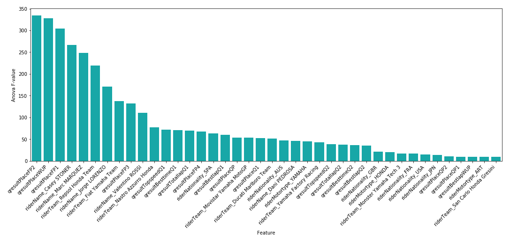
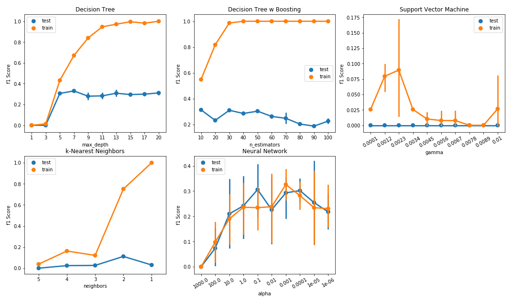
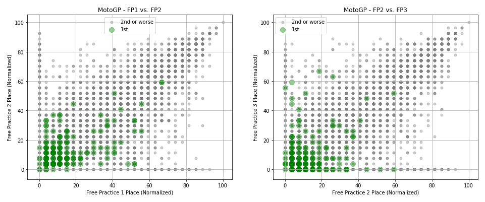
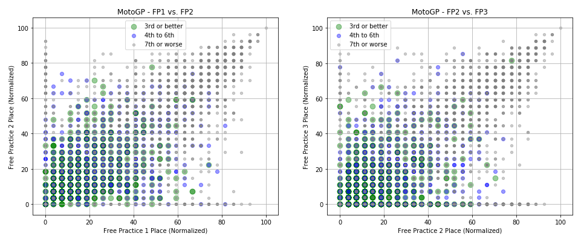
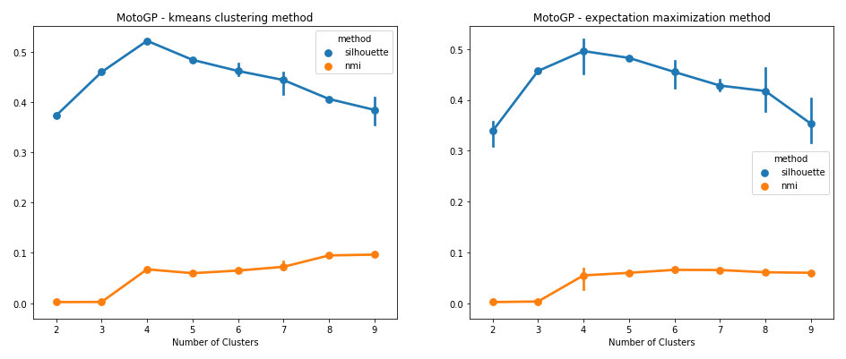
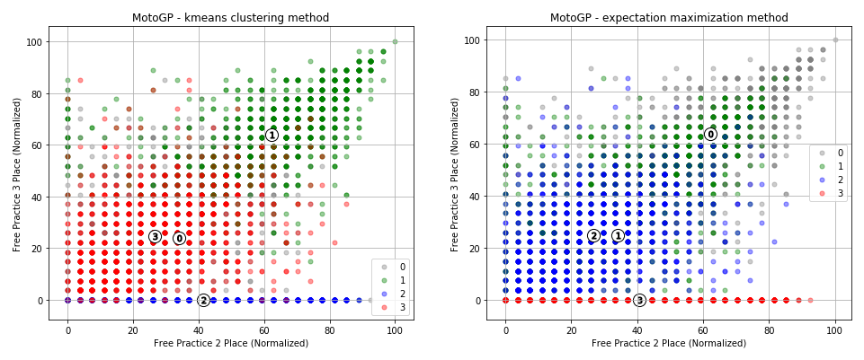
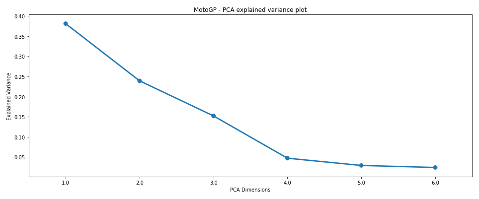
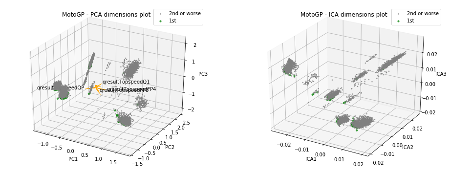
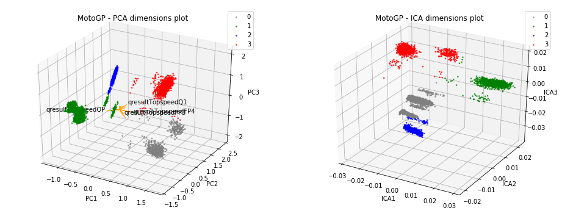

I recently came across the code for one of my first personal data science projects, written back in 2012. I originally took on this project to get more familiar with Python and scikit-learn, and clearly had a keen interest in MotoGP at the time. Looking back at the code, I was shocked to see that all the data wrangling and pre-processing steps were still working. So, I figured I would dust off the code, update it with some fresh data, and see what predictions it would generate.

## What is this about?

The MotoGP World Championship is the premier class of motorcycle road racing. The motorcycles used in each class are purpose-built racing machines that are neither available for purchase by the general public nor able to be ridden legally on public roads. All competitions currently use four-stroke motorcycles, with the current engine capacity limitations being 250cc for Moto3, 600cc for Moto2, and 1000cc for MotoGP.

Now, if you look around on the web, it's not difficult to find data related to the series. The official [MotoGP.com](https://www.motogp.com) website, for example, has an open and fairly deep set of data. It covers lap times, race results, track conditions, and much more. And so, where there is data, there is opportunity.

So, what would it take to build a supervised learning model capable of predicting MotoGP race winners?

## What data was available?

For this project, I made use of three types of data covering all seasons from 2007 through 2012, which I then updated to 2017.

First, I obtained data which described each of the race sessions, including the track name, the country where the track is located, track length, and climate. Next, I obtained qualifying and race result data. This included the rider's finishing place, best time, and top speed over not just the race session, but also their qualifying and practice sessions for each weekend. And finally, I found a set of rider data, which includes the rider's name, nationality, bike manufacturer, and team.

The breadth of data provided a number of dimensions for data exploration and the potential to discover less obvious relationships in the data. For example, did a particular rider or team favor a particular track or climate conditions?

## Data exploration

You can find results from my data exploration work in the Jupyter notebooks below, as well as on my GitHub page. But I wanted to highlight a couple of interesting observations. For one, I observed that over the 10-years of data, there had been only a handful of exceptional riders. Valentino Rossi, Casey Stoner, Jorge Lorenzo, and Marc Marquez were all regular winners. I would expect features common to these riders to be significant in any predictive model.

Additionally, I observed that MotoGP riders generally improve their times over each of the first three free practice sessions, only to post much slower times over the fourth free practice session. This observation is consistent with current MotoGP rules, which state that riders who achieve the top-12 fastest times over any of the first three free practice sessions will automatically proceed to the second qualifying session. This gives riders a real incentive to set their fastest times by the end of the third practice session. This led me to question whether the third or fourth practice session had more predictive power in determining race winners for that weekend.

## The approach

There are several machine learning methods available to predict winning riders. A ranking algorithm such as ordinal regression could be used to learn ordered rank; a classification algorithm could be used to classify riders as winners or losers; while a regression algorithm could be used to predict the rider's total race time or time behind the lead rider.

For this project, I chose a classification approach. Rather than 'hard' classifying each rider as a winner or loser, I decided to 'soft' classify them by predicting the probability that they belonged to the race winner class. This method had an advantage in that it allowed the number of classified race winners to be restricted to one winner per race.

To achieve this, I ranked the probabilities for each rider on a per-race basis and classified the rider with the greatest probability of falling into the race winner class as the single winner, so long as the probability for that rider was greater than 0.5. This was a simple method to interpret for a first-pass analysis without going too far down the implied probability path.

## Feature importance

After all of my feature processing routines, I was left with over 400 features for the MotoGP dataset, keeping in mind that I included dummy variables for each rider and team. With that being the case, I thought it would be worth deriving some feature importance measurements to make a high-level assessment on feature restriction.

I found that Free Practice 2 (FP2), Warm Up (WUP), and Free Practice 1 (FP1) results appeared to be the most important variables in determining race winners. This was interesting, as mainstream opinion would likely regard the third or fourth free practice or qualifying (Q) results as greater predictors for race winners. However, Q1 and Q2 results did not appear in the top-10 list of important variables at all.

## Building a predictive model

I tried applying five different learning algorithms for this project: a vanilla decision tree, a boosted decision tree, a support vector machine, a k-nearest neighbor approach, and a neural network. Each model has its own set of advantages and disadvantages, such as simplicity, training time, and ability to handle sparse data. In general, I hoped these five algorithms would provide broad coverage over the various machine learning techniques.

Now, in order to select an optimal algorithm and set of parameter values, I first had to nominate an optimization criterion. There are a number of possible criteria which can be used for a classification-based problem, with the most suitable method ultimately depending on the context of the problem.

Precision is one option, which is the ratio of how often the estimator correctly classifies a positive label to the total number of times it classifies a positive label. Recall is another option, which is the ratio of how often the estimator correctly classifies a label as positive to how many total positive labels there are. Accuracy, the ratio of correct classifications versus total classifications, would be a poor choice in this case. I could have achieved approximately 95% accuracy, for example, by simply classifying all riders as race losers (assuming each race had 20 riders).

Given this, I ended up optimizing according to F1 score. The F1 score can be interpreted as a weighted average of the precision and recall, where an F1 score reaches its best value at 1 and its worst at 0.

Finally, I had to make some decisions on the validation approach. Validation involves separating a dataset into subsets for training and testing. This allows the model to be trained on a training set and tested on an independent dataset. But what ratio should this split be? The learning curves below are a great way to see what sort of impact a training and testing split was having on results.

When looking at the learning curves, I noted the decision tree and boosted decision tree classifiers demonstrated severe overfitting, with a large delta between F1 scores on the training and test sets. In fact, the training set F1 score for both classifiers remained at 1.0, irrespective of the training set size. For the Support Vector Machine classifier, I also noted a large delta between F1 scores over the training and test sets, and therefore a tendency for this classifier to over-fit the data.

Considering these results, I decided to allocate 70% of the data as the training set and 30% as the test set, with this split being made after randomizing observations using Scikit Learn's `train_test_split` function. For final model selection, each of the various combinations of classifiers was trained and tested against a `StratifiedShuffleSplit` cross-validation loop as part of a `GridSearchCV` optimization routine.

Now, each of the discussed learning algorithms has a number of parameters which can be varied in order to control the complexity of the estimated model. By controlling these parameters, one is able to restrict the goodness-of-fit of the model on the training set of data and, in turn, prevent the model from over-fitting.

The figure below demonstrates the relationship between model performance and a range of complexity parameters. As with the learning curves discussed in the previous section, I expected the F1 score for the training and test sets to increase as the complexity parameter for each algorithm was relaxed, with the test set F1 score seeing diminishing returns for each subsequent increase in model complexity.

The decision tree and boosted decision tree classifiers provide perhaps the best example of the relationship between model fit and complexity. Here, I varied two key parameters: maximum tree depth for the decision tree and the number of estimators for the boosted version. Maximum depth (default: 'none') controls the longest path from the tree root to a leaf. The number of estimators (default: 50) determines the maximum number of boosting stages.

In both cases, training set performance increased while test performance plateaued or decreased as I increased these depth and estimator counts. Both estimators clearly over-fit, with the F1 score for the training set reaching close to 1.0 beyond a max depth of 13 for the decision tree classifier and beyond an estimator count of 40 for the boosted decision tree classifier. Clearly, there was a need to restrict parameter options when fitting these models.

## The results

You'll find the results in the table below.

| clf                                      | param                                                                                                                                                                                                                                                                                                                                                                                                                                                                                                                                                                                                                                                                                                                                                                                                                                                                                     | f1        | recall    | precision | time      |
| ---------------------------------------- | ---------------------------------------------------------------------------------------------------------------------------------------------------------------------------------------------------------------------------------------------------------------------------------------------------------------------------------------------------------------------------------------------------------------------------------------------------------------------------------------------------------------------------------------------------------------------------------------------------------------------------------------------------------------------------------------------------------------------------------------------------------------------------------------------------------------------------------------------------------------------------------------- | --------- | --------- | --------- | --------- |
| [DecisionTreeClassifier()]              | 'dt__criterion': 'gini', 'dt__max_depth': 6, ...                                                                                                                                                                                                                                                                                                                                                                                                                                                                                                                                                                                                                                                                                                                                                                                                                                   | 0.225806  | 0.132075  | 0.777778  | 0.046610  |
| [AdaBoostClassifier( DecisionTreeClassifier() )] | 'dtb__base_estimator__max_depth': 1, 'dtb__le...                                                                                                                                                                                                                                                                                                                                                                                                                                                                                                                                                                                                                                                                                                                                                                                                                                         | 0.423529  | 0.339623  | 0.562500  | 8.677857  |
| [SVC()]                                  | 'linsvc__C': 0.001, 'linsvc__gamma': 0.0001, ...                                                                                                                                                                                                                                                                                                                                                                                                                                                                                                                                                                                                                                                                                                                                                                                                                                   | 0.037037  | 0.018868  | 1.000000  | 23.621196 |
| [KNeighborsClassifier()]                | 'knn__leaf_size': 10, 'knn__n_jobs': -1, 'knn...                                                                                                                                                                                                                                                                                                                                                                                                                                                                                                                                                                                                                                                                                                                                                                                                     | 0.107143  | 0.056604  | 1.000000  | 0.198638  |
| [MLPClassifier()]                       | 'mlp__alpha': 1e-05, 'mlp__solver': 'adam', '...                                                                                                                                                                                                                                                                                                                                                                                                                                                                                                                                                                                                                                                                                                                                                                                                     | 0.125000  | 0.075472  | 0.363636  | 3.741494  |

In order to determine which classifier was 'best', I wanted to consider the run time in addition to reported performance metrics (F1 score, precision, and recall). As illustrated in the table above, the Support Vector Machine classifier produced poor F1 scores and also had the longest run time, making this classifier the worst candidate. Meanwhile, the results showed that the decision tree classifier had the shortest run time yet was able to produce favorable F1 scores.

Unfortunately, with F1 scores sitting below 0.5 for all classifiers, the initial performance was poor. So, perhaps not surprisingly, it’s a challenge to predict race winners. The only positive finding was that this method still outperformed a naive baseline of simply picking the winner of the previous race, which yielded an F1 score of 0.31 over the same data range.

## What's next?

Clearly, additional data would help improve results here. But what about use of unsupervised learning? I could try dimensionality reduction and clustering methods, for example, and use the output from those techniques to derive an additional set of engineered features. Those engineered features could then supplement the original set of raw features, and finally, I could re-apply my supervised learners and observe the results.

From the work presented above, I discovered that features representing a rider’s place over free practice sessions tended to have superior predictive power in determining the race winner for that weekend. To demonstrate this, the scatter plots below show riders expressed over these features, with points highlighted depending on the rider’s race place.

The figures above show that for both competitions, race winners tended to achieve superior results in free practice sessions compared to their rivals. There were exceptions, however, where some riders achieved a poor placement over both practice sessions yet went on to win the race for that weekend.

But these figures are shown over only two pairs of features. Would it be possible to identify clusters of data from the wider set of features? And did those clusters tend to represent classes of race winners versus race losers?

## Raw data clustering

I employed two different methods to derive data clusters. The first, k-means clustering, takes the unlabeled data and assigns it to one of 'k' clusters. Assignment to a cluster is based on the features of the data point, with the data point considered part of a group if it is closest to that cluster’s centroid. The second, Expectation Maximization (EM) clustering, shares similarities with the K-means approach. However, the methodology does not aim to maximize the differences in centroids between clusters, instead determining the probability of cluster memberships based on one or more probability distributions.

For both methods, however, I needed a means to determine an appropriate cluster count. This is where Silhouette and Mutual Information measures come in. Silhouette analysis is a technique that can be used to assess the separation distance between clusters, while Mutual Information measures the similarity between two labels of the same data point. Both measures are shown below for both k-means and EM clustering techniques.

Both measures suggested a cluster count of four was best suited for the data. To restate what was being shown, the results suggested that riders tend to fall within one of four clusters. Did these clusters line up with race winners, podium placers, mid-pack finishers, and race losers? To get some idea, let's look at what happened when these cluster assignments were applied over the same free practice features used for the scatter plots above.

It appeared that the cluster assignments had been able to identify both a group of riders who reported no place over FP3 (for whatever reason), and had reasonably separated riders who placed well over practice sessions from those who had not.

## Dimensionality reduction

I wanted to try two dimensionality reduction methods for this. The first, Principal Component Analysis (PCA), combines features to create a set of component features, each with minimal information loss. PCA does this by projecting data points for each feature to a line of largest variance, retaining those features which exhibit the largest variance. The second method, Independent Component Analysis (ICA), is a linear dimension reduction method which aims to identify independent components, assuming that each sample of data is a mixture of independent components.

To get an idea of how many PCA components I should retain, I first looked at the amount of explained variance per component, which you'll find in the figure below.

Here, I looked for the components which captured the majority of explained variance (i.e., at what component number does the drop-off in explained variance tend to flatten?). Clearly, from the figure above, there was good merit in selecting four components for the dataset, as most of the explained variance was captured before this point.

Now, I could take this component count, apply the clustering method, and then pass those engineered features back to my supervised learning methods. But in the spirit of visualizing the work, I first took a look at how rider performance looks over three dimensions, since visualizing four dimensions is not feasible.

The results were not particularly insightful. It seemed each cluster had grabbed a set of winning riders, and at least visually, I couldn't see any cluster having a greater allocation of winners. Again, note that this was over three dimensions, rather than the four the scores pointed towards.

But what about all the other features? What did the cluster assignments look like over those features? That's one of the many ways that dimensionality reduction methods can help. We can use these methods to reduce the set of features to a much smaller set of components, and then observe how clusters place over the reduced data.

## Dimensionality reduced data clustering

In the figure below, the set of dimensionality-reduced data points is shown with K-means clustering applied. Note that I re-assessed the clustering count using the reduced data points and found a count of four to again be most appropriate via Silhouette and Mutual Information measures. Hence, why you see four clusters highlighted below.

Interestingly, much better separation between clusters was visible with the reduced data.

## Engineering features

As a final step, I went ahead and took the steps above to automate the generation of a set of engineered features. Each of these features would have values taking the form of a cluster label. To improve the chances of success, I generated features for both the raw and dimensionality-reduced data for a wide range of possible dimensions and cluster counts.

These engineered features (along with the original set of raw features) were then passed through to the supervised learner, in the hope that I could get some improvement in classification accuracy.

## The results

You'll find the results in the table below.

| clf                                           | f1        | recall    | precision | time       |
| --------------------------------------------- | --------- | --------- | --------- | ---------- |
| [DecisionTreeClassifier()]                   | 0.131148  | 0.071429  | 0.800000  | 0.161972   |
| [AdaBoostClassifier(DecisionTreeClassifier())]| 0.574468  | 0.482143  | 0.710526  | 26.477024  |
| [SVC()]                                       | 0.035088  | 0.017857  | 1.000000  | 54.810338  |
| [KNeighborsClassifier()]                      | 0.131148  | 0.071429  | 0.800000  | 0.558008   |
| [MLPClassifier()]                             | 0.294737  | 0.250000  | 0.358974  | 8.248912   |

In the previous supervised-only approach, the best F1 score I had been able to achieve was 0.42 with the boosted decision tree classifier. With the new features, however, I was able to achieve an F1 score of 0.57. Not only that, but recall was now almost greater than 0.5, which was much more encouraging. I also saw some improvement with all other classifiers except for the vanilla decision tree.

## What's next?

By employing unsupervised learning, I managed to see a respectable improvement in the performance of the majority of my classifiers. While the performance is still not high enough for any real-world application, it’s a great sign that a reasonably accurate model can be created to predict race winners.

