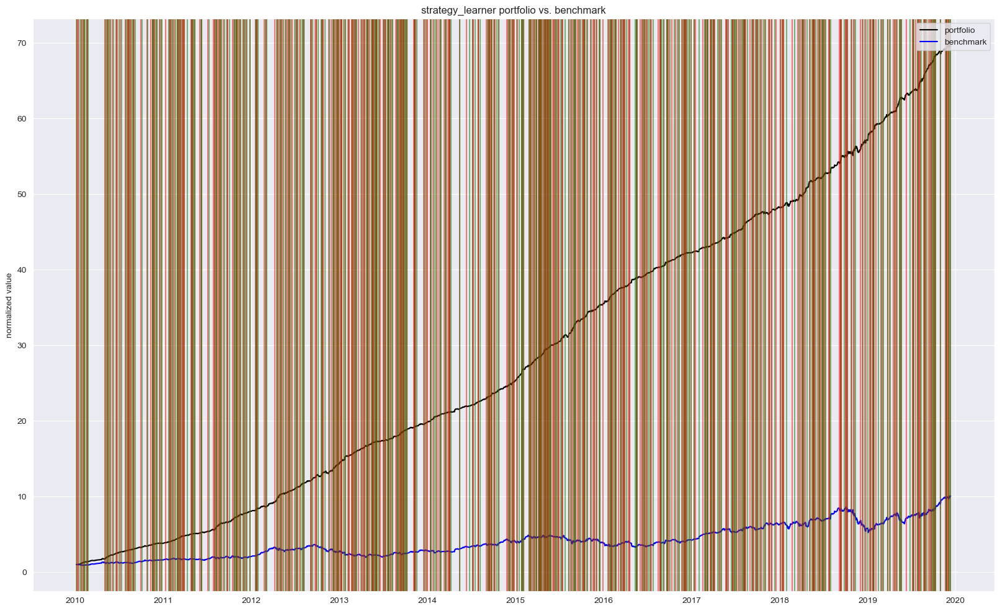
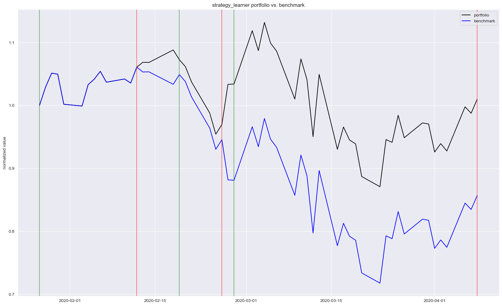

# Can we teach an AI to trade?

This article explores the application of Reinforcement Learning to algorithmic trading, specifically focusing on developing a trading strategy for a publicly-listed asset using historical price data.

While supervised learning models, particularly time-series methods like LSTMs, are commonly used for predicting asset prices or returns, Reinforcement Learning (RL) offers a different paradigm. Instead of predicting the future, RL aims to learn an optimal policy for taking actions within an environment. This makes it a compelling, albeit complex, approach for developing autonomous trading agents.

## What is reinforcement learning?

Reinforcement Learning is a computational framework for learning sequential decision-making. It comprises an **agent** that interacts with an **environment** over discrete time steps. At each time step, the agent observes the environment's **state**, takes an **action** from a set of possible actions, and receives a numerical **reward**. The agent's goal is to learn a **policy**—a mapping from states to actions—that maximizes the cumulative reward over an episode.

Now picture that this agent is trained over thousands, or even millions of training examples. Where the agent is able to see a state, take an action and recognize a reward or penalty. Given enough examples, such an agent is expected to learn to select the best possible action based on a given state. And as such, be expected to repeat those best choices for future given states.

It’s a simple, yet elegant framework. And it’s obviously quite flexible in its construct, which makes it suitable for use over many types of domains and problems. And as no surprise, we are seeing more and more real-world applications of the technique. Self-driving cars, robotics, video-game AI and of course, applications within the financial sector. With reinforcement learning being used as a basis to train autonomous trading bots, capable of interpreting and trading based on new data in almost real-time.

## What is the problem we are trying to solve?

The objective is to train a trading agent for Apple (AAPL) stock using a Q-learning algorithm. The agent will learn a policy to take one of three discrete actions—BUY, SELL, or HOLD—at a daily frequency. The environment's state is defined by a vector of common technical indicators, including momentum (Rate of Change), moving averages, the Relative Strength Index (RSI), and Moving-Average Convergence-Divergence (MACD). These indicators provide a quantitative representation of the market's recent behavior.

Relating our problem to the reinforcement learning framework I describe above. Our ‘state space’ is going to be made up of a series of technical price indicators. Including a measure of daily price momentum a.k.a rate of change, a measure of average prices over a moving window, a measure of Relative Strength Index, and finally, a measure of Moving-Average Convergence-Divergence. These measures are commonly used by traders and speculators to inform technical strategies, so why not allow our agent to leverage these measures to describe the current state of Apple’s share price?

In terms of ‘action set’. Our agent can make three possible actions per day. The agent can buy, sell or hold. The buy and sell amounts are set to a fixed quantity, governed by an initial starting value. But the agent can go both long and short on Apple’s share price. It’s important to point out however, that the agent must maintain either a long or short position once an initial trade is made. And the agent’s position is never able to exceed the fixed quantity. Meaning that if the agent is already long the fixed quantity. It must hold that position until it provides a sell action to go short by the same fixed quantity.

## Our implementation

The implementation leverages several open-source Python libraries. Technical indicators are generated using the [Technical Analysis Library in Python](https://github.com/bukosabino/ta). The core logic is encapsulated in two classes: a `QLearner` class that implements the Q-learning algorithm and manages the Q-table, and a `StrategyLearner` class that orchestrates the training and testing phases by interfacing the agent with the market data.

Now the more challenging part. We will create two classes in order to build our agent. First, the ‘StrategyLearner’ class. Which can be called to provide training data in order to build the Q-learning matrix and train it’s weights. Or to use that trained agent, to provide actions based on a set of test data. And second, a ‘QLearner’ class, which is able to be called on by ‘StrategyLearner’ as part of the Q-learning matrix build.

Finally, we create a series of definitions including ‘compute_portvals’, ‘compute_portfolio_stats’ and ‘market_simulator’, in order to translate the buy and sell trade orders from the agent, into a portfolio evaluation. This evaluation includes rates and volatility of returns. As well as a benchmark back to a simple buy-and-hold strategy for if we instead bought the same fixed-quantity of Apple shares at the start of the period, and sold at the end.

You can find all of my code below, as well as via my GitHub page. And note that I have included an additional function so that you can download data from Yahoo! Finance and run everything yourself.

## And finally, the results

You’ll find two figures below. Both figures show the indexed portfolio value from following our agent's strategy, as well as for the simple buy-hold strategy. Note that the green and red vertical lines represent buy and sell trades for the agent's strategy.

The in-sample results from the 10-year training period show the agent achieving a 60x return, significantly outperforming the buy-and-hold benchmark. With nearly 750 trades over the period, the agent learned an aggressive policy. However, this high performance is a strong indicator of overfitting; the agent has likely memorized the optimal actions for the training data rather than learning a generalizable strategy.

When deployed on the out-of-sample test data (the first quarter of 2020), the agent's performance, while still superior to the benchmark, was substantially more modest. This confirms the overfitting hypothesis. On a positive note, the agent successfully navigated the COVID-19 market downturn by taking short positions, and it demonstrated a more conservative trading frequency with only six executions.

## Where to from here?

While this Q-learning implementation serves as an interesting proof-of-concept, it is not robust enough for live trading. Key limitations include the lack of transaction costs (commission and slippage), the simplicity of the state representation, and the use of a discrete, tabular Q-learning approach which does not scale well to continuous state spaces.

Future work should explore Deep Q-Networks (DQN) or continuous control algorithms like A2C or PPO, which can handle more complex, high-dimensional state inputs and potentially learn more nuanced policies. Either way, I hope this project provides a solid foundation for others interested in exploring these more advanced Deep Reinforcement Learning architectures in the context of financial markets.
